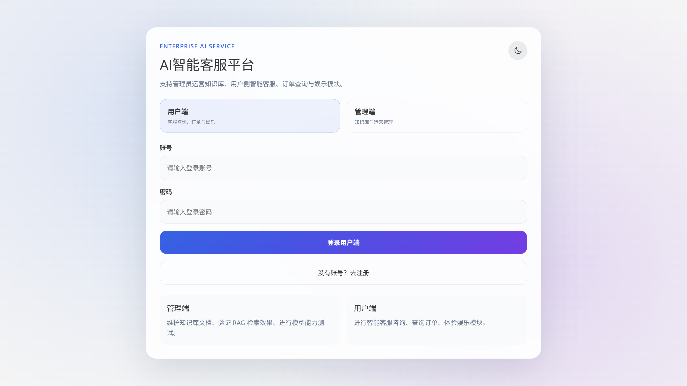
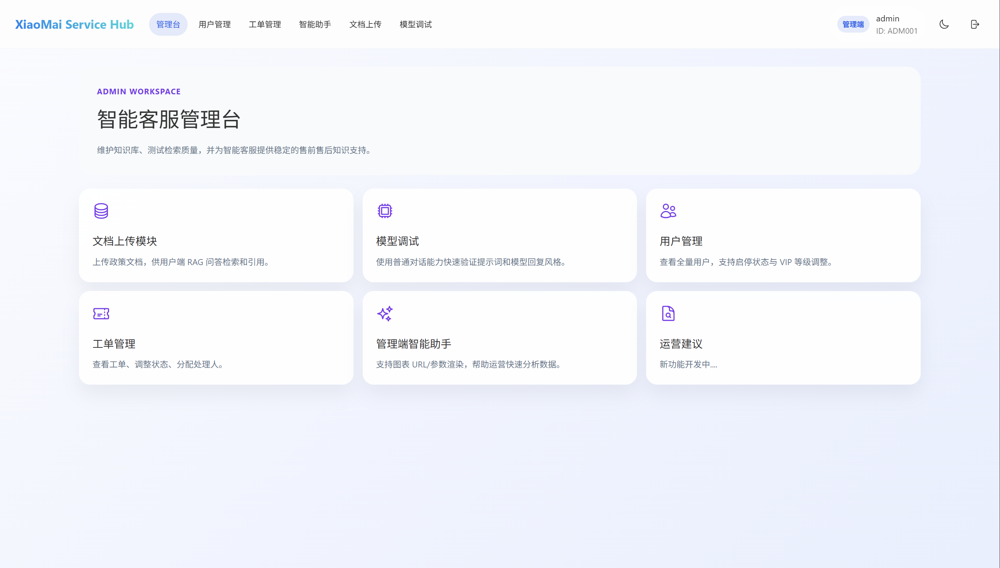
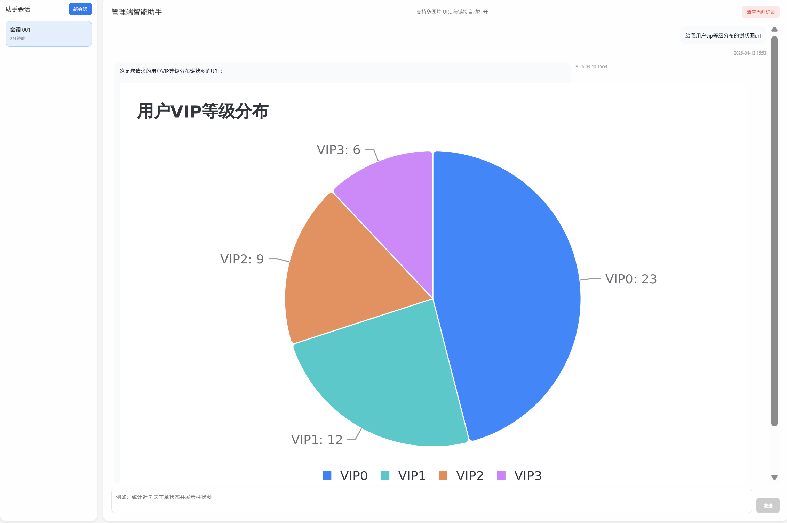
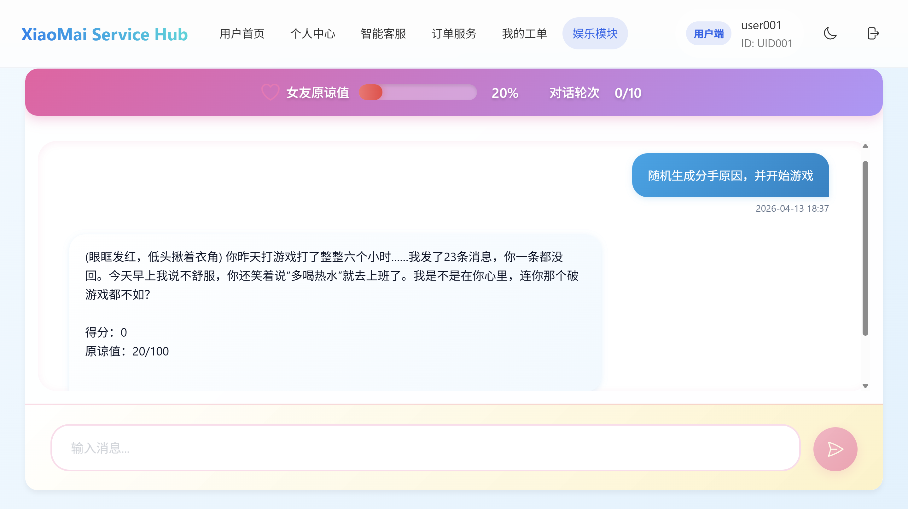
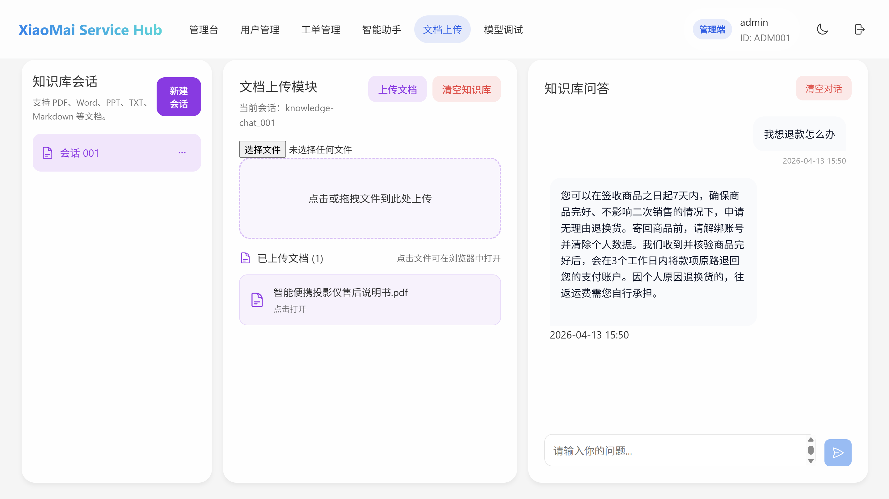
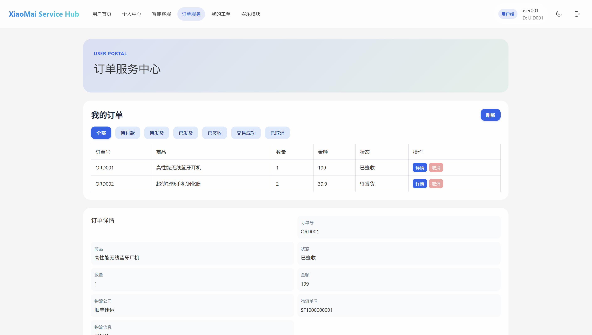
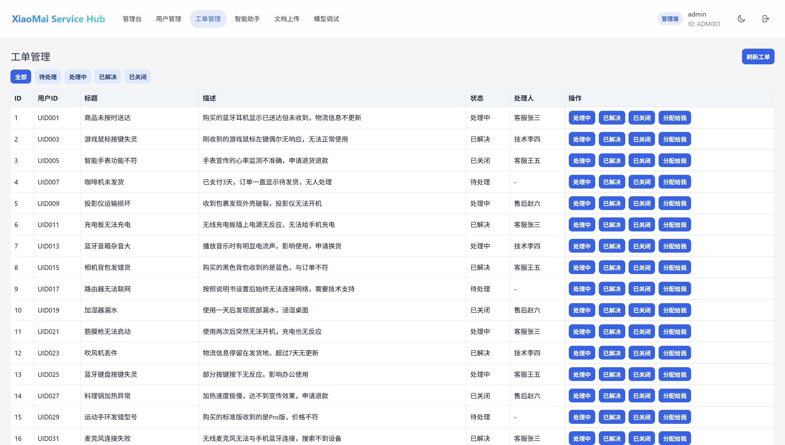
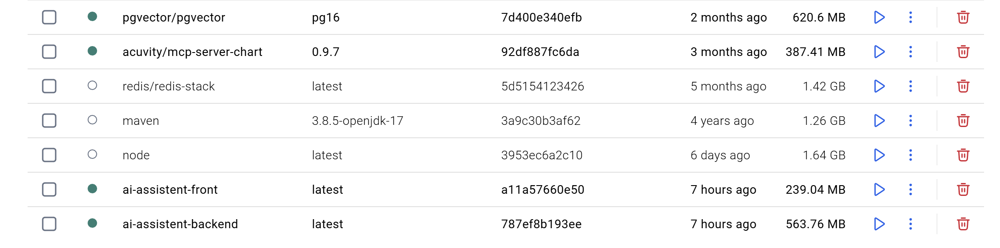
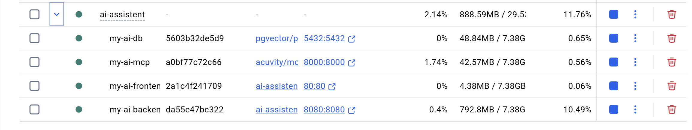

# AI Assistant Hub 项目说明文档

## 一、项目简介

这是一个基于 Spring Boot 3 和 Vue 3 的 AI 智能助手应用，采用 Docker Compose 实现前后端一键部署。

### 📸 项目预览
**登录界面** 




<table>
  <tr>
    <td >用户端主界面<br></td>
    <td >管理端主界面<br></td>
  </tr>
</table>


<table>
  <tr>
    <td >用户端智能助手界面(意图识别工具调用)<br></td>
    <td >管理端智能助手界面(Mcp工具调用)<br></td>
  </tr>
</table>


<table>
  <tr>
    <td >用户端游戏界面(提示词工程)<br></td>
    <td >管理端文档问答界面(Rag)<br></td>
  </tr>
</table>

<table>
  <tr>
    <td >用户端订单界面<br></td>
    <td >管理端工单界面<br></td>
  </tr>
</table>

<table>
  <tr>
    <td >docker镜像界面<br></td>
    <td >docker容器界面<br></td>
  </tr>
</table>

## 二、功能特性

- ✅ 前后端分离架构
- ✅ AI对话功能集成
- ✅ AI智能管理订单
- ✅ AI向量检索生成
- ✅ 用户权限管理（普通用户/管理员）
- ✅ Docker一键部署
- ✅ API文档自动生成


## 三、项目亮点

- 采用Spring AI集成阿里云大模型服务
- 使用Pgvector向量数据库支持AI应用
- 多阶段Docker构建优化镜像大小
- 前后端分离的现代化开发模式
- 用户对话记忆隔离
- 完整rag流程
- AI意图智能识别

## 四、技术栈

**后端**：Spring Boot 3 + Maven + Spring AI(Alibaba) + MyBatisPlus

**前端**：Vue 3 + Vite + TypeScript

**数据库**：PostgreSQL + Pgvector 16

**部署**：Docker + Docker Compose（多阶段构建）

## 五、项目目录结构

```
项目根目录(主要)
├── backend                 # 后端源码文件夹
│   ├── src                  # Java 源码
│   ├── pom.xml              # Maven 配置文件
│   └── Dockerfile           # 后端镜像构建文件
├── frontend                # 前端源码文件夹
│   ├── src                   # Vue 源码
│   ├── index.html           # 入口 HTML
│   ├── package.json         # 依赖配置
│   ├── vite.config.ts       # Vite 配置
│   ├── nginx.conf           # Nginx 配置文件
│   └── Dockerfile           # 前端镜像构建文件（多阶段）
├── init-sql
│   └── init.sql             # 初始化建表语句(本项目主要侧重于ai应用,数据库数据固定)
├── docker-compose.yml       # 容器编排配置
└── README.md                # 本说明文档
```

## 六、快速开始（第一次使用必看!!!请务必看完readme再进行操作!!!）

### 重要提醒：
1. 在windows里使用docker命令时,必须要下载docker desktop,并且配置好wsl2,docker desktop本质运行在linux虚拟机里
2. 如果你直接打开某个文件选择在终端中打开,然后去执行docker命令,可能会发现docker命令用不了,你需要直接cmd打开终端,然后从起始终端一步步 cd 进入你的目标文件夹执行docker命令才行

### 1. 环境要求
- 安装 Docker Desktop（27.0 以上版本），并确保 Docker Compose 可用。
- 确保 80 端口（前端）和 8080 端口（后端）未被其他程序占用。

### 2. 克隆项目到本地
```bash
git clone https://github.com/zy-1910287579/AI-Assistant-Hub.git
cd AI-Assistant-Hub
```

### 3. 配置密钥（重要）
在项目根目录下创建一个名为 `.env` 的文件，写入以下内容（请替换成你自己的真实密钥）：
```
OPENAI_API_KEY=sk-xxxxxxxxxxxxxxxxxxxxxxxxxxxxxxxx
```
你只需要替换一个apikey即可,其他环境已经在compose指定了

注意：`.env` 文件已被 Git 忽略，不会提交到仓库。

### 4. 启动所有服务
```bash
docker compose up -d
```
（docker compose 一个dockercompose命令整体,up:构建并启动,-d:后台运行）

第一次启动会自动构建镜像，需要下载依赖，大概需要 3 到 10 分钟，请耐心等待。

看到两个服务的 Status 都变成 Up 就说明启动成功了。此时你可以看你的docker desktop的containers栏会有运行的容器,在images栏会有你下载好的镜像,一般是主目录文件名+docker compose文件服务名的命名

### 5. 访问应用
- **前端界面**：在浏览器打开 http://localhost
  - 需要登录,你可以看init.sql文件的user表和admin表的用户名和密码来进行登录,这里提供两个登录账号
  - 用户端 账号:user001  密码:123456
  - 管理端 账号:admin     密码:123456
- **后端接口**：http://localhost:8080

## 七、常用命令参考（建议新手直接看docker desktop即可）

- 查看所有容器的运行状态：`docker compose ps`
- 查看后端实时日志：`docker compose logs -f backend`
- 停止所有服务：`docker compose down`
- 停止并删除数据库数据卷（慎用）：`docker compose down -v`
- 修改代码后重新构建并启动：`docker compose up -d --build`
- 强制无缓存重新构建前端镜像：`docker compose build --no-cache front`

## 八、本地开发调试（不用 Docker）

**后端开发**：
```bash
cd backend
./mvnw spring-boot:run
```

**前端开发**：
```bash
cd frontend
npm install
npm run dev
```

## 九、Docker 部署原理

### 构建和编排
用 Docker 实现项目的"一次打包，到处运行"

我们想让自己的项目在任何地方都能顺利运行，排除各种各样的环境依赖问题，就需要将项目及其所有依赖（包括运行环境、依赖库等）全部打包成一个独立的单元。这相当于复制了一份项目所需的最小运行环境，这个单元在 Docker 中被称为"镜像"。

Docker 正可以帮助我们快速实现这种项目打包，并在它创建的隔离环境（容器）中运行项目。这个打包过程，在 Docker 中被称为"构建"，即构建我们项目所需的最小运行环境。

然而，Web 项目大多是分离设计的，例如前后端分离、数据库、消息队列、缓存中间件等。这些不同部分的运行环境往往是不一样的（例如，后端用 Java 运行时，前端用 Node.js 构建再由 Nginx 服务，数据库用 MySQL）。因此，我们需要根据不同的运行环境，分别编写对应的 Dockerfile 来构建各自的镜像。

实际上，大部分情况下，只有我们自己开发的自定义模块（如前端、后端应用）才需要编写 Dockerfile，数据库等中间件可以直接使用官方提供的成熟镜像。

当我们需要启动整个项目时，必须在启动时指定各个模块之间的依赖关系（例如，后端应用需要等待数据库服务先启动）。这时，我们可以选择一个个手动启动容器，但这繁琐且容易出错。更主流、更优雅的方式是利用 docker-compose.yml 文件，将所有服务的启动参数、网络配置、依赖关系等信息封装起来。

最终，使用者只需要在项目根目录下执行一条简单的命令：
```bash
docker-compose up -d
```
即可实现一键启动整个复杂的分布式应用。

正如那句话所说："多写一点"（指开发者编写 Dockerfile 和 docker-compose.yml）,"用的人就少考虑一些"（指使用者只需一个命令即可启动整个系统，无需关心复杂的环境配置和依赖关系）。这正是 Docker 和 Docker Compose 在现代软件开发和部署中的核心价值所在。

## 十、API 接口文档

- 链接：http://localhost:8080/swagger-ui/index.html

## 十一、常见问题及解决方法

1. **启动时提示端口被占用**
   - 修改 docker-compose.yml 文件中 ports 部分的宿主机端口，例如将前端端口改为 8081:80。

2. **前端构建报错 Could not resolve entry module "index.html"**
   - 检查 vite.config.ts 文件，确保 root 选项指向了正确的 index.html 所在目录（通常是 ./src）。

3. **修改 .env 文件后不生效**
   - 执行 `docker compose up -d --force-recreate backend` 强制重建后端容器。

4. **如何进入容器内部查看文件？**
   - 后端容器：`docker exec -it 容器名 sh`
   - 前端容器：`docker exec -it 容器名 sh`

5. **镜像下载失败（极有可能）**
   - 在docker desktop进入设置,点击docker engine,换入
   ```
   "registry-mirrors": [
   "https://mirror.ccs.tencentyun.com",
   "https://docker.mirrors.ustc.edu.cn"
   ]
   ```
   - 如果你在用代理(建议),在设置的resource里找到proxies(代理的意思),然后在Manual proxy configuration前两行填入你的代理地址一般就没什么问题了
   - 如果在docker compose up -d 命令构建的过程中,出现无法拉取某个镜像的问题,请参考以下步骤
     1. 先单独拉取失败的镜像,比如,nginx拉取失败,先单独执行`docker pull nginx`(默认latest),一般即可拉取成功
     2. 如果一步骤失败则,进入docker desktop里在左边栏会有docker hub,里面可以搜索你想要的镜像,在右边栏直接下载对应的镜像版本即可
     3. 或者你可以直接进入https://hub.docker.com网站,这里是镜像网站总部,找到你要的镜像在右边栏会有Run in docker desktop,点击即可
   - 注意:2,3步骤一般需要代理

## 十二、注意事项

- `.env` 文件存放真实密钥，一定不要提交到 Git 仓库！
- 第一次构建时间较长是因为需要下载 Maven 和 npm 的依赖，后续启动只需几秒。
- 如果前端页面无法访问，请检查后端容器日志是否报错（尤其是 API Key 是否有效）。

## 十三、开发周期

- 项目时间：40天
- 日均时常: 6到8小时
- 个人完成度：100%

## 十四、联系方式与许可证

本项目或有不足之处，如有问题或对AI应用感兴趣的小伙伴欢迎联系 1910287579@qq.com,让我们一起使用AI,擅用AI,驾驭AI!
